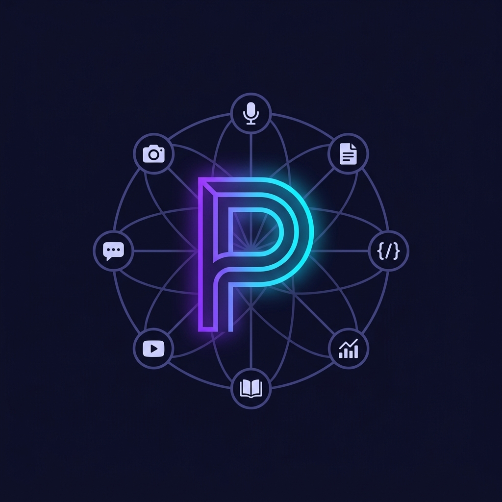

# @dtmirizzi/pi-openrouter-multimodal

<p align="center">
  
</p>

OpenRouter multimodal tool integration for [Pi](https://github.com/earendil-works/pi-coding-agent).
Provides **8 independently toggleable tools** with per-modality model selection
and session-persistent settings.

| Tool | What it does |
|------|-------------|
| **`web_search`** | Server-side web search with real-time results |
| **`web_fetch`** | Fetch page content from a URL (web, docs, PDFs) |
| **`image_generate`** | Text-to-image generation via OpenRouter chat completions |
| **`image_understand`** | Analyze images via vision models |
| **`video_understand`** | Analyze videos (YouTube links work with Gemini) |
| **`pdf_read`** | Extract and analyze PDF content |
| **`tts_speak`** | Text-to-speech via OpenRouter `/audio/speech` endpoint |
| **`stt_transcribe`** | Speech-to-text via OpenRouter `/audio/transcriptions` endpoint |

## Install

```bash
pi install npm:@dtmirizzi/pi-openrouter-multimodal
```

Or from a local checkout:

```bash
pi install /path/to/pi-openrouter-multimodal
```

## API Key

The extension resolves the OpenRouter API key from (priority order):

1. `OPENROUTER_API_KEY` environment variable
2. Pi model registry (provider `openrouter`)
3. `~/.pi/agent/models.json` under `providers.openrouter.apiKey`

## Commands

| Command | Description |
|---------|-------------|
| `/web-tools` | Toggle tools on/off and configure search/fetch engines |
| `/web-models` | Select models per modality (image, vision, video, PDF, TTS voice, STT) |
| `/web-search` | Toggle `web_search` and configure search engine |
| `/web-fetch` | Toggle `web_fetch` and configure fetch engine |

Each command opens an interactive overlay. Use `↑↓` to navigate, `←→` to
cycle values, `Esc` to close. Settings persist across sessions and survive
compaction, shutdown, and tree navigation.

### `/web-tools`

Toggle each tool on/off and set search/fetch engine preferences. Also includes
a verbose/compact status-bar display toggle.

### `/web-models`

Select the model for each modality from a list fetched live from the OpenRouter
API at startup. Falls back to a comprehensive built-in list if the API is
unavailable.

## Tools

### web_search

| Parameter | Type | Default | Description |
|-----------|------|---------|-------------|
| `query` | string | required | Search query |
| `engine` | string | auto | auto, native, exa, firecrawl, parallel |
| `max_results` | integer | 5 | Results per search (1-25) |
| `search_context_size` | string | — | low (5K), medium (15K), high (30K) |
| `allowed_domains` | string[] | — | Only return results from these domains |
| `excluded_domains` | string[] | — | Exclude results from these domains |

### web_fetch

| Parameter | Type | Default | Description |
|-----------|------|---------|-------------|
| `url` | string | required | URL to fetch content from |
| `engine` | string | auto | auto, native, exa, openrouter, firecrawl, parallel |
| `max_content_tokens` | integer | — | Max content length (approximate tokens) |

### image_generate

| Parameter | Type | Default | Description |
|-----------|------|---------|-------------|
| `prompt` | string | required | Text prompt describing the image |
| `model` | string | state | Override the default model from `/web-models` |

Selected via `/web-models`. Models are fetched live from OpenRouter at startup;
fallback list includes Gemini Flash Image, GPT-5 Image, FLUX.2, Seedream,
Riverflow, Recraft, Grok Imagine, and more.

### image_understand

| Parameter | Type | Default | Description |
|-----------|------|---------|-------------|
| `url` | string | required | Image URL or base64 data URL |
| `prompt` | string | Describe this image in detail | Analysis prompt |
| `model` | string | state | Override default from `/web-models` |

### video_understand

| Parameter | Type | Default | Description |
|-----------|------|---------|-------------|
| `url` | string | required | Video URL (YouTube links work with Gemini) |
| `prompt` | string | Describe what happens in this video | Analysis prompt |
| `model` | string | state | Override default from `/web-models` |

### pdf_read

| Parameter | Type | Default | Description |
|-----------|------|---------|-------------|
| `url` | string | required | URL of the PDF document |
| `prompt` | string | Summarize this document | Analysis prompt |
| `model` | string | state | Override default from `/web-models` |
| `engine` | string | cloudflare-ai | cloudflare-ai (free), mistral-ocr (scanned docs), or native |

### tts_speak

| Parameter | Type | Default | Description |
|-----------|------|---------|-------------|
| `text` | string | required | Text to convert to speech |
| `model` | string | state | Override default from `/web-models` |
| `voice` | string | state | Override default from `/web-models` |

### stt_transcribe

| Parameter | Type | Default | Description |
|-----------|------|---------|-------------|
| `audio` | string | required | Base64-encoded audio data |
| `format` | string | required | wav, mp3, flac, m4a, ogg, webm, aac |
| `model` | string | state | Override default from `/web-models` |
| `language` | string | — | ISO-639-1 language code (optional) |

## How It Works

All tools proxy requests through OpenRouter's API:

- **web_search / web_fetch** — Chat completions with server tool definitions
  (`openrouter:web_search` / `openrouter:web_fetch`)
- **image_generate** — Chat completions with `modalities: ["image", "text"]`
  on the selected image generation model
- **image_understand / video_understand** — Chat completions with
  multimodal content blocks (`image_url`, `video_url`)
- **pdf_read** — Chat completions with file content block and
  `file-parser` plugin
- **tts_speak** — Direct call to `/api/v1/audio/speech`
- **stt_transcribe** — Direct call to `/api/v1/audio/transcriptions`

### Model Discovery

On startup, the extension fetches available models from
`GET /api/v1/models?output_modalities=...` and caches them for use in the
`/web-models` settings panel. If the API is unreachable, a comprehensive
set of fallback models is used.

## Development

```bash
# Install dependencies
npm install

# Run tests
npm test               # all tests
npm run test:unit      # unit tests only
npm run test:integration  # requires OPENROUTER_API_KEY

# Format and lint
npm run fmt            # format all files
npm run lint           # lint + fix all files
npm run check          # format + lint + organize imports
npm run check:ci       # strict CI check (format + lint, no writes)
```

The repo uses [Biome](https://biomejs.dev/) for formatting and linting.
CI enforces both on every push and PR.

## Assets


## References

- [OpenRouter Web Search docs](https://openrouter.ai/docs/guides/features/server-tools/web-search)
- [OpenRouter Web Fetch docs](https://openrouter.ai/docs/guides/features/server-tools/web-fetch)
- [OpenRouter Multimodal overview](https://openrouter.ai/docs/features/multimodal/overview)
- [OpenRouter Image Generation](https://openrouter.ai/docs/features/multimodal/image-generation)
- [OpenRouter TTS](https://openrouter.ai/docs/features/multimodal/text-to-speech)
- [OpenRouter List Models API](https://openrouter.ai/api/v1/models)
